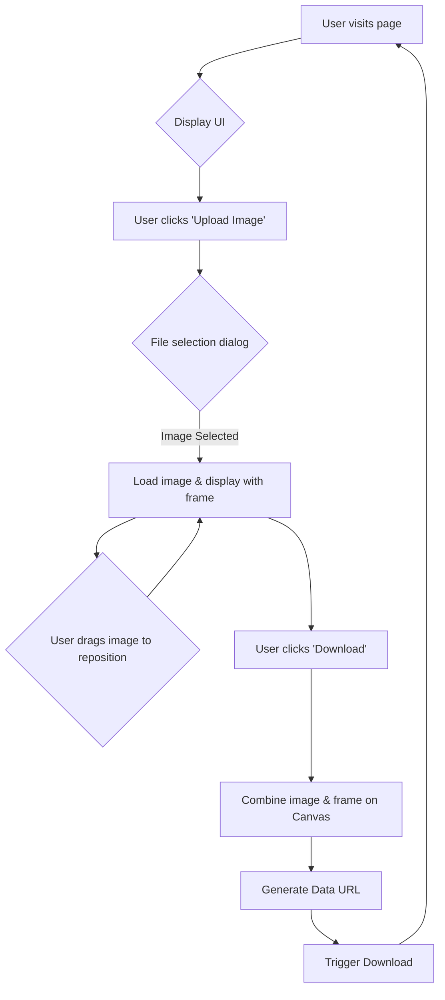

# Simple Mode Twibbon Feature Plan

**1. Project Setup & Assets:**

- **Frame Image:** Place `frame.png` in `public/`. (Note: Ensure this file exists or is provided).
- **Dependencies:** Use React state (`useState`) and HTML Canvas API. No new major dependencies anticipated.

**2. UI Implementation (`app/page.tsx`):**

- **File Input:** Add `<input type="file" accept="image/*" />` for image selection.
- **Display Area:** Create a container `div`. Inside, use either:
  - An HTML `<canvas>` element.
  - Layered `` elements (one for user photo, one for frame) with absolute positioning.
- **Repositioning Logic:** Implement drag-and-drop for the uploaded image using JavaScript event handlers or a simple library. Store position (x, y) in state.
- **Download Button:** Add a `<button>` to trigger image combination and download.

**3. Logic Implementation (`app/page.tsx`):**

- **State Management:** Use `useState` for:
  - Uploaded image file/data URL.
  - Position (x, y offset) of the uploaded image.
  - Loading/processing states.
- **File Handling:** Use `FileReader` to read the uploaded file and get a data URL.
- **Canvas Rendering (for Download):**
  - On "Download" click:
    - Create/use a `<canvas>`.
    - Set dimensions.
    - Draw the uploaded image at its current position.
    - Draw the `frame.png` over it.
    - Convert canvas to data URL (`canvas.toDataURL('image/png')`).
    - Create a temporary link (`<a>`) and trigger download.

**4. Styling:**

- Use existing CSS setup (e.g., Tailwind via `app/globals.css` or component-specific styles).

**Visual Flow:**

